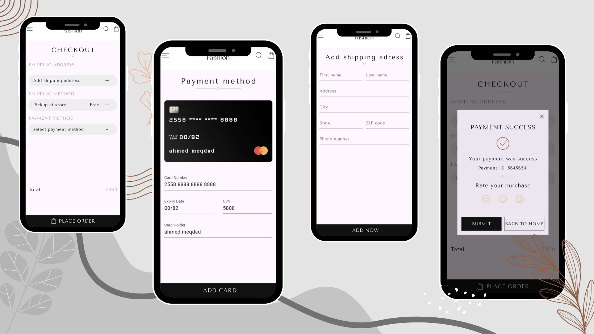

# 🛍️ Open Fashion

Open Fashion is a modern and elegant Flutter application that simulates a fashion shopping experience. It features a clean UI, SVG-based design elements, and interactive components. Designed with scalability and modularity in mind, this app is a great foundation for mobile commerce solutions.

---

## 📦 Project Overview

Open Fashion is a cross-platform mobile app built using Flutter. It offers a stylish interface for browsing fashion products, managing a shopping cart, completing payments, and rating purchases. The app emphasizes reusable components, responsive design, and smooth user interaction.

---

## 🧰 Tech Stack

- **Framework**: Flutter 3.6.1
- **Language**: Dart
- **UI Assets**: SVGs, PNGs, Custom Fonts
- **Packages**:
  - `flutter_svg` – SVG rendering
  - `flutter_credit_card` – Credit card UI
  - `flutter_launcher_icons` – App icon generation
  - `cupertino_icons` – iOS-style icons

---

## 🏗️ Architecture

The app follows a component-based architecture with clear separation of concerns:

- **Screens**: Main views like `Home`
- **Components**: Reusable widgets (e.g., `CustomText`, `CustomButton`, `CartWidget`)
- **Models**: Data structures like `ProductModel`
- **Core**: Centralized constants (e.g., colors)
- **Assets**: Organized folders for images, SVGs, fonts, and texts

---

## ✨ Features

- 🛒 Cart management with quantity control
- 💳 Payment confirmation dialog with rating system
- 🔍 SVG-based search and navigation icons
- 📦 Shipping method selector
- 🎨 Custom fonts and themed UI
- 📱 Responsive design for Android and iOS
- 🌙 Dark mode support

---

## 🚀 How to Run the Project

1. **Clone the repository**  
- git clone https://github.com/a7med2002/open_fashion_app.git

2. **Install dependencies** 
- flutter pub get

3. **Run the app**
- flutter run

---

## 🖼️ Screenshots

---

## 🌐 Social Links

- 👨‍💻 Developer: [ِAhmed Meqdad]
- 📧 Email: [ahmd2002mqdad@gamil.com]
- 💼 LinkedIn: [linkedin.com/in/ahmed-meqdad](https://www.linkedin.com/in/ahmed-meqdad)